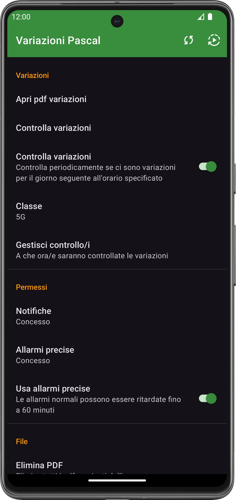
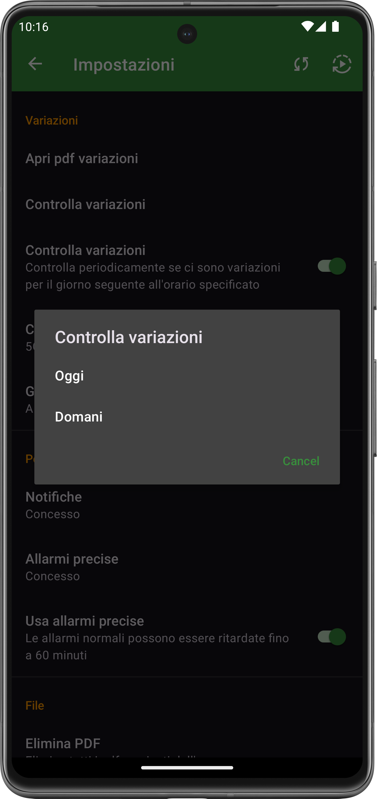
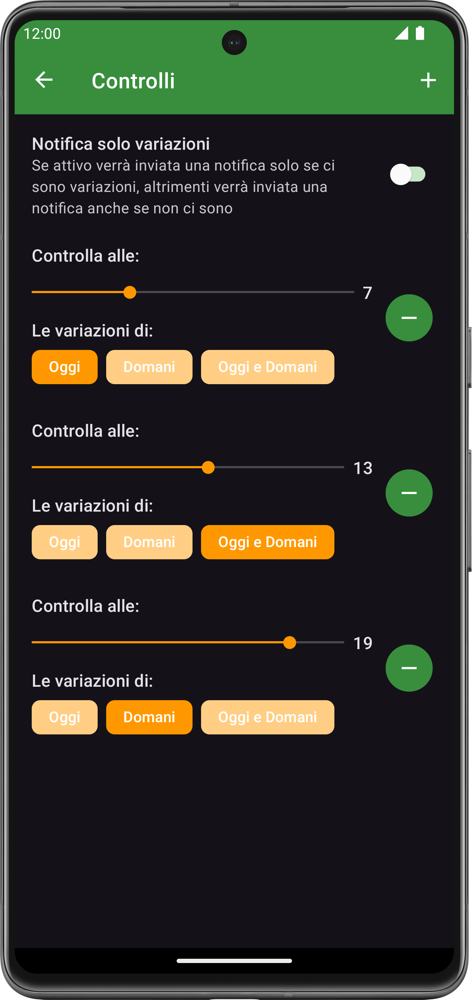

  
  <h1>AppVariazioniScolastiche</h1>
  
Applicazione Android per controllare le variazioni d'orario sul sito dell'ITT Blaise Pascal

  [ITT Blaise Pascal](https://www.ispascalcomandini.it/variazioni-orario-istituto-tecnico-tecnologico/) •
  [Installazione](https://github.com/matteraga/AppVariazioniScolastiche/releases/latest)

  ---

  
  
  

